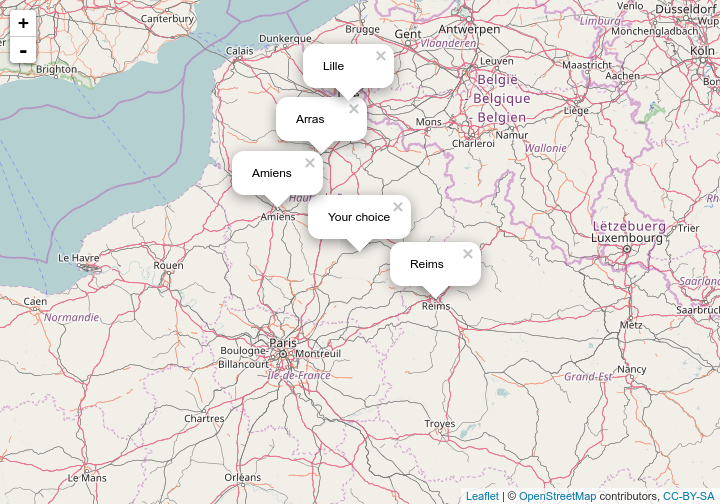

## Description of the project

1. The current project promts the user to choose a point on a map and how many nearby cities to select. The database of the cities that we use is available under MIT license at [simplemaps.com](http://simplemaps.com/resources/world-cities-data) and contains "over 7,300 cities from around the world, including all country/province capitals, major cities and towns, as well as smaller towns in sparsely inhabited regions".
2. For each such city, the database contains (among other data) its latitude and longitude, so the correct way of computing distances in this app is via the so called
[Haversine formula](https://en.wikipedia.org/wiki/Haversine_formula)

$$latex d = 2 r \operatorname{arcsin}\left({\sqrt{\operatorname{sin}^2\left(\frac{\varphi_2 - \varphi_1}{2}\right)+\operatorname{cos}(\varphi_1)\operatorname{cos}(\varphi_2)\operatorname{sin}^2\left(\frac{\lambda_2 - \lambda_1}{2}\right)}}\right) $$
  
where:

- d is the distance between any two given points on the surface of the Earth;

- R is the radius of the Earth; $latex (\varphi_1,\lambda_1)$ are the latitude and longitude of the first point and analogously for the second one.

--- .class #id 

## Computations

1. The functions $latex \operatorname{sin}$, $latex \operatorname{cos}$ and $latex \operatorname{arcsin}$ are all available in standard R, but we have to use them properly, i.e. giving as argument latitudes and longitudes in radians, not in grads. So after loading the data frame in memory, we have to add two additional columns with the coordinates in radians.

2. Since the computation of the Haversine formula is resource demanding, we retain for further analysis only the points in the data frame whose latitude and longitude is not too far away from the one given by the user while clicking any point of the map.

3. The resulting distances are sorted, and only the closest cities are displayed on the map. The user can select any number of cities to show between 2 and 30.

Since this presentation does not make use of a Shiny server, in the next slide we have selected
a particular latitude and longitude in France (namely (49°59', 3°20')), and we apply our algorithm only to that particular pair.

---

## Demo



--- 

## Further information

Since the user could be also interested on the exact locations that he/she selected on the map,
this information is provided in the user interface. Moreover, the relevant information about the nearby cities is provided, for example:


```
##     Name Latitude Longitude Distance
## 1  Arras   50°28'     2°78'  97.5 km
## 2  Lille   50°65'      3°8' 119.1 km
## 3  Reims   49°25'      4°3' 125.9 km
## 4 Amiens   49°90'     2°30' 133.9 km
```

Note that the package Leaflet uses the standard [Equirectangular projection](https://en.wikipedia.org/wiki/List_of_map_projections), which does not represent faithfully the Earth's surface near the North and South Poles. This creates no problems for the computation of the distances using the Haversine formula, but results in strange behaviours near the Poles (that is, points **apparently** very far away on the map, but with very small computed distance between them).

Further resources: [shinyApp on shinyapps.io](), [code on github]().
